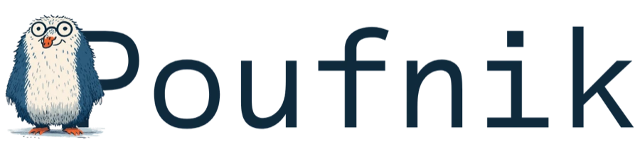
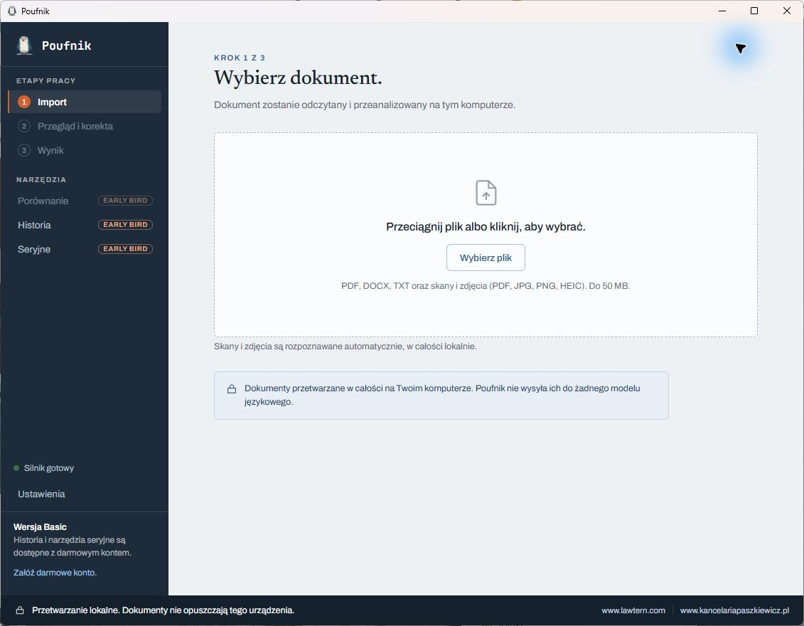
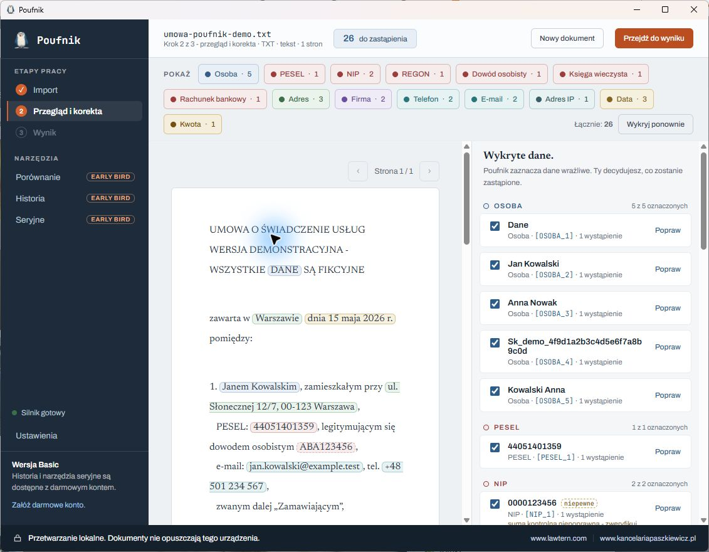
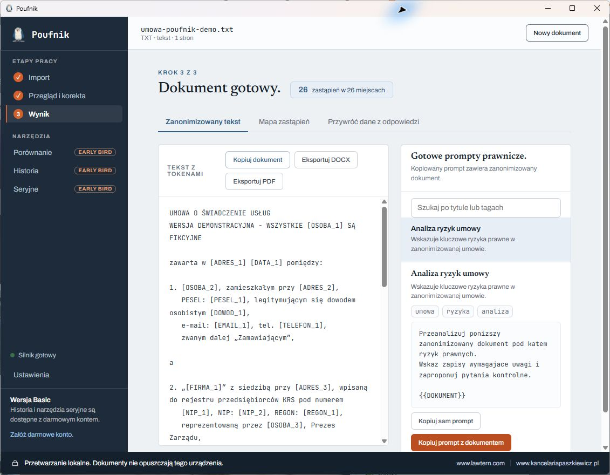

<p align="center">
  
</p>

<p align="center">
  <strong>Przygotuj polskie dokumenty do pracy z AI, bez wysyłania ich treści do zewnętrznego modelu.</strong>
</p>

<p align="center">
  <a href="https://poufnik.app">Pobierz dla Windows</a> ·
  <a href="https://github.com/paszkiewiczmichal/poufnik/releases/latest">Najnowsze wydanie</a> ·
  <a href="README.md">English version</a>
</p>



Poufnik to darmowa aplikacja desktopowa open source do anonimizacji dokumentów przed użyciem ChatGPT, Claude, Copilota lub innego narzędzia AI. Odczyt pliku, OCR, wykrywanie danych, anonimizacja, eksport i przygotowanie promptu odbywają się na komputerze użytkownika. Treść dokumentu nie jest wysyłana do dostawcy AI.

Aplikacja jest projektowana dla polskich dokumentów. Rozpoznaje krajowe identyfikatory oraz wzorce językowe, w tym odmianę nazwisk, aby dokument można było sprawdzić i zanonimizować, zanim opuści organizację.

> Zrzut pokazuje obszar importu zainstalowanej aplikacji. Dokumenty są przetwarzane lokalnie, zanim zostaną użyte z narzędziem AI.

## Dlaczego Poufnik

- **Lokalnie z założenia.** Cały proces dokumentowy działa na urządzeniu. Aplikacja komunikuje się z silnikiem wyłącznie lokalnie, przez `127.0.0.1`.
- **Dla polskich dokumentów.** Wykrywa m.in. PESEL, NIP, REGON, KRS, dowody osobiste, paszporty, rachunki bankowe i karty płatnicze, numery ksiąg wieczystych, sygnatury, adresy, współrzędne, adresy IP/MAC, klucze API, kwoty, osoby, firmy i dane kontaktowe.
- **Pełna kontrola użytkownika.** Każde wykrycie można sprawdzić, oznaczyć lub wyłączyć, zmienić jego kategorię, połączyć wystąpienia wspólnym tokenem albo ręcznie dodać pominięty fragment.
- **Pliki, skany i zdjęcia.** Importuje PDF, DOCX i TXT oraz skany i obrazy. OCR, gdy jest potrzebny, działa lokalnie.
- **Praktyczne przekazanie do AI.** Możesz skopiować zanonimizowany tekst, wyeksportować go do DOCX lub PDF albo przygotować prompt prawniczy z dokumentem.
- **Kontrolowana odwracalność.** Lokalna mapa zastąpień pozwala przywrócić tokeny w odpowiedzi AI na tym samym komputerze. Mapa nie jest kopiowana razem z tekstem.
- **Konto nie jest potrzebne.** Darmowy Basic zapewnia pełną anonimizację. Bezpłatne konto Early Bird odblokowuje dodatkowe narzędzia, a treść dokumentów nadal pozostaje lokalnie.

## Dla kogo

- Dla radców prawnych, adwokatów, kancelarii i działów prawnych przygotowujących umowy, pisma, korespondencję oraz akta do pracy wspieranej przez AI.
- Dla zespołów HR, finansów, compliance i operacji pracujących na dokumentach z danymi osobowymi lub poufnymi.
- Dla konsultantów, badaczy i pracowników instytucji publicznych, którzy chcą omówić dokument z AI bez ujawniania identyfikatorów.
- Dla organizacji, które chcą wdrożyć praktyczną warstwę prywatności przed użyciem AI w obiegu dokumentów.

Poufnik przygotowuje materiał do bezpieczniejszej pracy. Nie zastępuje oceny prawnej, bezpieczeństwa ani kontroli człowieka - gotowy tekst zawsze należy sprawdzić przed udostępnieniem.

## Jak działa

1. **Zaimportuj dokument.** Przeciągnij plik do aplikacji albo wybierz go z dysku. Poufnik obsługuje PDF, DOCX, TXT, JPG, PNG i HEIC do 50 MB.
2. **Sprawdź wykrycia.** Przejrzyj podświetlone dane i użyj panelu bocznego, aby je zaakceptować, odznaczyć lub poprawić. Gdy czegoś brakuje, dodaj własne zaznaczenie.
3. **Wygeneruj bezpieczną wersję.** Poufnik zastąpi zaakceptowane dane spójnymi tokenami, np. `[OSOBA_1]` albo `[PESEL_1]`.
4. **Użyj wyniku w AI.** Skopiuj zanonimizowany tekst, wyeksportuj DOCX/PDF albo skopiuj gotowy prompt zawierający dokument.
5. **W razie potrzeby przywróć odpowiedź lokalnie.** Wklej odpowiedź AI z tokenami i użyj lokalnej mapy zastąpień, aby odtworzyć dane.

## Zrzuty ekranu

### Przegląd i korekta wykryć



### Zanonimizowany dokument gotowy do pracy z AI



Zrzuty wykorzystują [całkowicie fikcyjną umowę demonstracyjną](docs/demo/umowa-poufnik-demo.txt), bezpieczną do zaimportowania podczas poznawania aplikacji.

## Prywatność i łączność

Wrażliwa część pracy pozostaje na urządzeniu: odczyt dokumentu, OCR, wykrywanie, anonimizacja, eksport oraz przywracanie tokenów w odpowiedzi AI. Poufnik nie wysyła treści dokumentu do modelu AI ani zewnętrznej usługi przetwarzania dokumentów.

Internet może być używany tylko przez opcjonalne, odrębne funkcje, np. sprawdzenie manifestu aktualizacji albo konto Early Bird. Sprawdzanie aktualizacji jest przy pierwszym uruchomieniu dobrowolne i można je później zmienić w Ustawieniach. Świadomie otwarte linki do stron WWW są uruchamiane w przeglądarce systemowej. Te połączenia nie przesyłają treści dokumentów.

Lokalne przetwarzanie może wspierać realizację procesów RODO i AI Act, ale zgodność zależy od całego obiegu dokumentu, konfiguracji i kontroli człowieka.

## Wersje aplikacji

| Wersja | Dostępność | Zakres |
| --- | --- | --- |
| **Basic** | Bezpłatna, bez logowania | Pełna anonimizacja lokalna, korekta, OCR, eksport i przygotowanie promptu |
| **Early Bird** | Bezpłatne konto | Historia, porównanie obok siebie, przetwarzanie seryjne i własne reguły wykrywania |
| **Pro** | W przygotowaniu | Dokładniejsze wykrywanie danych wrażliwych |
| **Enterprise** | W przygotowaniu | Integracja API z obiegiem dokumentów |

## Instalacja i użycie

1. Pobierz aktualny instalator Windows z [poufnik.app](https://poufnik.app) albo z [najnowszego wydania na GitHubie](https://github.com/paszkiewiczmichal/poufnik/releases/latest).
2. Uruchom instalator, a następnie otwórz **Poufnik** z menu Start.
3. Wybierz **Rozpocznij bez logowania**, aby od razu korzystać z Basic, albo załóż bezpłatne konto Early Bird dla dodatkowych funkcji.
4. Przy pierwszym uruchomieniu wybierz, czy zezwalasz na sprawdzanie aktualizacji wyłącznie po numerze wersji.

## Struktura repozytorium

| Katalog | Zawartość |
| --- | --- |
| `desktop/` | Aplikacja desktopowa Tauri 2, React i TypeScript |
| `engine/` | Lokalny silnik anonimizacji w Pythonie uruchamiany jako sidecar |
| `corpus/` | Mały, syntetyczny polski korpus ewaluacyjny używany przez testy |

## Rozwój

Aplikacja desktopowa jest rozwijana dla Windows. Wymaga Visual Studio 2022 Build Tools z obciążeniem **Desktop development with C++** oraz `link.exe` dostępnego w terminalu.

```powershell
where link
```

```bash
cd engine && uv sync && uv run pytest && uv run ruff check .
cd desktop && npm install && npm run test && npm run lint && npm run tauri dev
```

## Wydania

Tagi zaczynające się od `v` budują podpisany instalator Windows w GitHub Actions i publikują go razem z manifestem aktualizacji Tauri na stronie [Releases](../../releases).

## Licencja

Apache License 2.0. Zobacz [LICENSE](LICENSE). Copyright 2026 Kancelaria Radcy Prawnego Michał Paszkiewicz.
